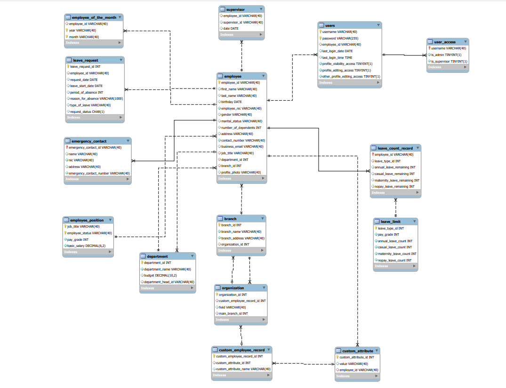

# HRMS Database Design for Jupiter Apparels

## Overview

This project is a **Human Resource Management System (HRMS)** designed for **Jupiter Apparels**, a multinational apparel corporation. The project involves creating a robust and scalable database to support **Personal Information Management (PIM)** and **Absence Management** for over 1000 employees, with future scalability for additional modules such as payroll and inventory management. 

The database is designed with MySQL to ensure scalability, consistency, and ease of maintenance. It incorporates foreign key constraints, indexing, procedures, and triggers to maintain the ACID properties of the system.

## Key Features

1. **Personal Information Management (PIM) Module**: 
   - Stores detailed employee information such as name, birth date, marital status, emergency contact details, dependents, job titles, pay grades, and employment status.
   - Supports the addition of custom employee attributes (e.g., Nationality) without altering the database schema.
   - Supports organizational structure with supervisors and subordinates.
   
2. **Absence Management Module**: 
   - Manages employee leave requests with four predefined leave types (Annual, Casual, Maternity, No-Pay).
   - Configurable leave balances based on pay grade, with mandatory 50 No-Pay leaves for all employees.
   - Leave requests follow an approval workflow (submitted to supervisors for approval).
   
3. **User Management**:
   - Fine-grained access control with different roles (e.g., employee, Admin, supervisor) and custom authorization levels.
   - Each user account is linked to an employee record. 
   - An admin user creates an initial HR manager user, who then manages further employee records.

4. **Reporting Module**:
   - Predefined reports, such as employees by department, leaves by period, job title grouping, and custom fields reports.
   
5. **ACID Properties**:
   - Ensured through the use of MySQL procedures, functions, and triggers to maintain transactional integrity, enforce consistency, and ensure atomic updates across related tables.

---

## Database Schema Design

The database consists of the following key entities:

1. **Employee**: Stores personal and job-related data about employees.
2. **Job Title**: Defines different roles within the organization (e.g., HR Manager, Accountant).
3. **Pay Grade**: Defines the pay level of an employee (Level1, Level2, etc.).
4. **Employment Status**: Tracks the type of employment (Intern, Contract, Permanent, etc.).
5. **Leave Type**: Manages different types of leaves (Annual, Casual, Maternity, No-Pay).
6. **Absence**: Tracks employee leave applications and approval status.
7. **User**: Stores user login credentials, linked to the employee for authorization purposes.
8. **Reports**: Generates various reports for management insights.

---
## Main Access Levels

1. **Admin**:
   - Full system access, including management and configuration.
   - Responsible for creating the first HR manager and other users.
   - Can manage all system settings, employee records, and permissions.

2. **Supervisor**:
   - Limited management access.
   - Can approve or deny leave requests from subordinates.
   - Able to view and update subordinate information but has restricted access to other modules.

3. **Employee**:
   - Basic access level with view-only permissions for personal information.
   - Cannot edit personal details or access others' information.
   - Can submit leave requests, which go to the assigned supervisor for approval.
## Database Setup

### Requirements

- **MySQL Server 8.0+**
- MySQL Workbench or another MySQL client for executing queries

## Database Population

Sample organization and leave limit data have been pre-inserted into the database. You can find the basic structural details in the `Main ER Diagram.pdf` file, including:

- Organization Information: Name, address, registration number.
- Job Titles: HR Manager, Accountant, Software Engineer, QA Engineer.
- Pay Grades: Level1, Level2, Level3.
- Leave Types: Annual, Casual, Maternity, No-Pay.
- Sample Employee Records: Employee details such as name, date of birth, job title, and supervisor relationships.

---

## Assumptions

- The initial system is designed for a single organization but can be expanded to support multiple companies in future iterations.
- Leaves and employee data are managed on a per-organization basis.
- Custom fields can be added by users but will need to be manually inserted into the database (a future enhancement could allow this via a front-end).

---

## Future Enhancements

- **Payroll Management**: Integration of payroll calculations based on leave data and dependent information.
- **Inventory Management**: Manage inventory related to apparel production.
- **Frontend Application**: A user-friendly UI/UX for easier data entry and visualization.

---
